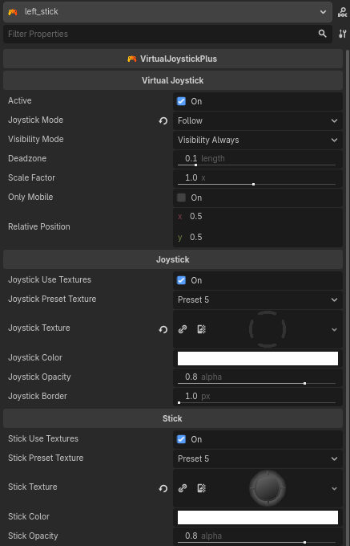
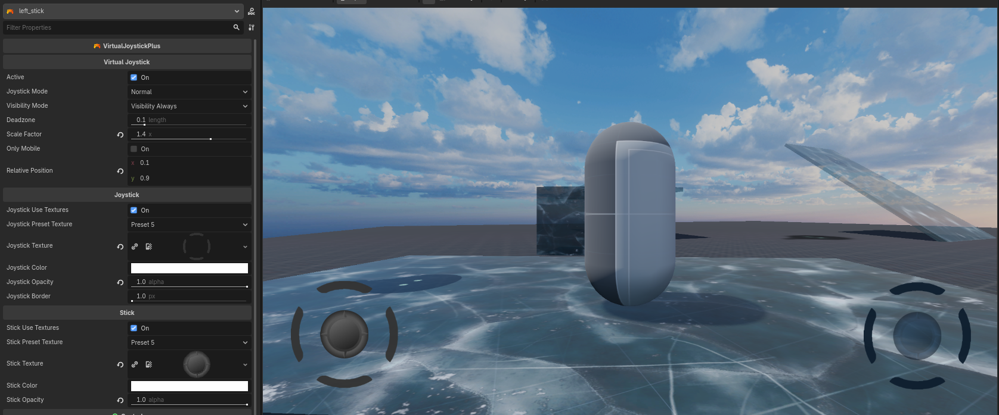

# Virtual Joystick Plus for Godot

**VirtualJoystickPlus** is a fully featured and highly configurable on-screen joystick plugin for **Godot Engine 4.5+**.  
Designed specifically for mobile and touch-based games, it provides precise analog input, multiple interaction modes, flexible visibility control, and extensive visual customization.

---

## Features

- Multiple joystick interaction modes: **NORMAL**, **DYNAMIC**, and **FOLLOW**.
- Configurable visibility behavior (always visible or only while touching).
- Normalized analog output (direction, distance, and angles).
- Linear **deadzone** handling with enter/leave signals.
- Normalized positioning using relative coordinates (0.0 → 1.0).
- Fully customizable visuals using shapes or textures.
- Mobile-aware visibility option.

---

## Installation

1. Copy the plugin folder into your Godot project:

```bash
addons/virtual_joystick_plus/
```

2. Enable the plugin in the editor:

**Project → Project Settings → Plugins → VirtualJoystickPlus → Enable**

---

## How to Use

1. Add a **VirtualJoystickPlus** node to your scene (inside a `Control`).
2. Configure the joystick mode, visibility mode, and appearance in the Inspector.
3. Connect the `analogic_changed` signal or poll values directly.

### Example (Signal-based)

```gdscript
func _on_virtual_joystick_plus_analogic_changed(
    value: Vector2,
    distance: float,
    angle: float,
    angle_clockwise: float,
    angle_not_clockwise: float
) -> void:
    velocity = value * max_speed * distance
```

### Example (Polling)

```gdscript
@onready var joystick: VirtualJoystickPlus = $VirtualJoystickPlus

func _physics_process(delta: float) -> void:
    var dir := joystick.get_value()
    if dir.length() > 0.0:
        player.velocity = dir * SPEED
    else:
        player.velocity = Vector2.ZERO
```

---

## ⚙️ Exported Properties

### General

| Property            | Type             | Description                                                  |
| ------------------- | ---------------- | ------------------------------------------------------------ |
| `active`            | `bool`           | Enables or disables joystick input.                          |
| `joystick_mode`     | `JoystickMode`   | Defines how the joystick behaves (NORMAL, DYNAMIC, FOLLOW).  |
| `visibility_mode`   | `VisibilityMode` | Controls when the joystick is visible.                       |
| `deadzone`          | `float`          | Linear deadzone threshold (0.0 – 0.9).                       |
| `scale_factor`      | `float`          | Global scale multiplier for joystick size.                   |
| `only_mobile`       | `bool`           | Shows the joystick only on mobile platforms.                 |
| `relative_position` | `Vector2`        | Normalized base position (0–1) relative to the Control size. |

### Joystick (Base)

| Property                  | Type        | Description                                      |
| ------------------------- | ----------- | ------------------------------------------------ |
| `joystick_use_textures`   | `bool`      | Enables texture rendering for the joystick base. |
| `joystick_preset_texture` | `Preset`    | Selects a predefined joystick texture.           |
| `joystick_texture`        | `Texture2D` | Custom joystick base texture.                    |
| `joystick_color`          | `Color`     | Base color of the joystick.                      |
| `joystick_opacity`        | `float`     | Opacity of the joystick base (0–1).              |
| `joystick_border`         | `float`     | Width of the joystick border.                    |

### Stick (Thumb)

| Property               | Type        | Description                              |
| ---------------------- | ----------- | ---------------------------------------- |
| `stick_use_textures`   | `bool`      | Enables texture rendering for the stick. |
| `stick_preset_texture` | `Preset`    | Selects a predefined stick texture.      |
| `stick_texture`        | `Texture2D` | Custom stick texture.                    |
| `stick_color`          | `Color`     | Stick (thumb) color.                     |
| `stick_opacity`        | `float`     | Stick opacity (0–1).                     |

---

## Joystick Modes

- **NORMAL**  
  Fixed position joystick. Only reacts to touches that start inside the base area.

- **DYNAMIC**  
  The joystick appears at the touch position and remains fixed until release.

- **FOLLOW**  
  Similar to DYNAMIC, but the base follows the finger when the stick reaches its maximum radius.

---

## Visibility Modes

- **VISIBILITY_ALWAYS**  
  The joystick is always visible.

- **VISIBILITY_WHEN_TOUCHED**  
  The joystick appears only while the screen is being touched.

---

## Signals

| Signal                                                                           | Description                                  |
| -------------------------------------------------------------------------------- | -------------------------------------------- |
| `analogic_changed(value, distance, angle, angle_clockwise, angle_not_clockwise)` | Emitted whenever the joystick value changes. |
| `deadzone_enter()`                                                               | Emitted when the stick enters the deadzone.  |
| `deadzone_leave()`                                                               | Emitted when the stick leaves the deadzone.  |

---

## Methods

| Method                                     | Returns   | Description                                     |
| ------------------------------------------ | --------- | ----------------------------------------------- |
| `get_value()`                              | `Vector2` | Returns the normalized direction vector.        |
| `get_distance()`                           | `float`   | Returns the normalized distance (0–1).          |
| `get_angle_degrees_clockwise()`            | `float`   | Returns the clockwise angle in degrees.         |
| `get_angle_degrees_not_clockwise()`        | `float`   | Returns the counter-clockwise angle in degrees. |
| `get_angle_degrees(continuous, clockwise)` | `float`   | Returns a specific angle configuration.         |

---

## Screenshots




---

## ❤️ Support

If this project helps you, consider supporting:

https://github.com/sponsors/Saulo-de-Souza
